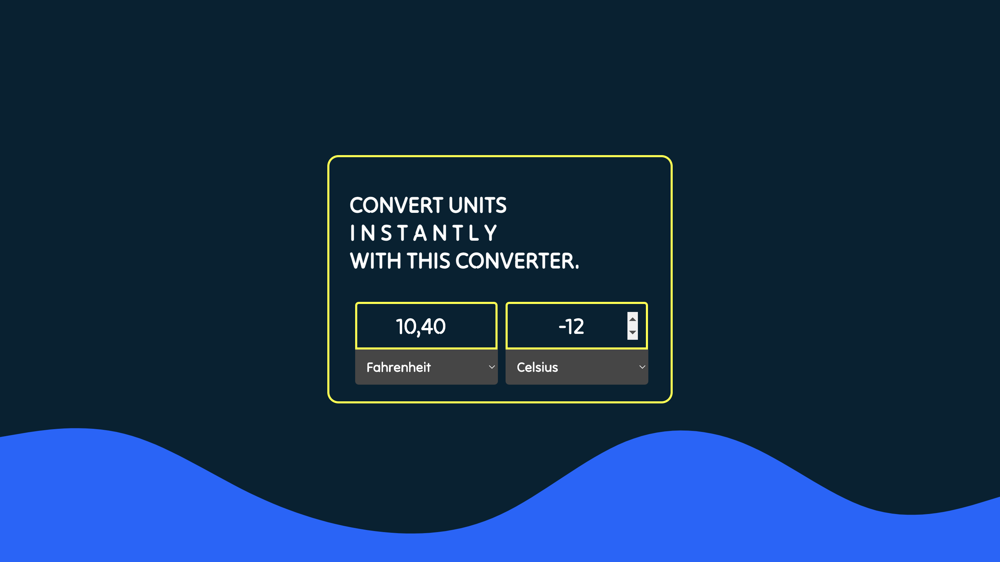

# 🌡 Temperature converter 🌡

## 🌌 What's it about?

Mini-project and mini-converter at the same time! Fun way to practise JS basic like switch case and select dropdown.

## 🌌 First look 
Really basic front, but decent if You ask me.

## 🌌 Technologies

+ mostly JavaScript

## 🌌 Inspiration
This little project is part of an amazing Full Stack Developer Course created by  ♥ Ania Kubow ♥. Love this women, her sense of humor and ability to explain hard code-things in a way that I finally understand. 🏆
